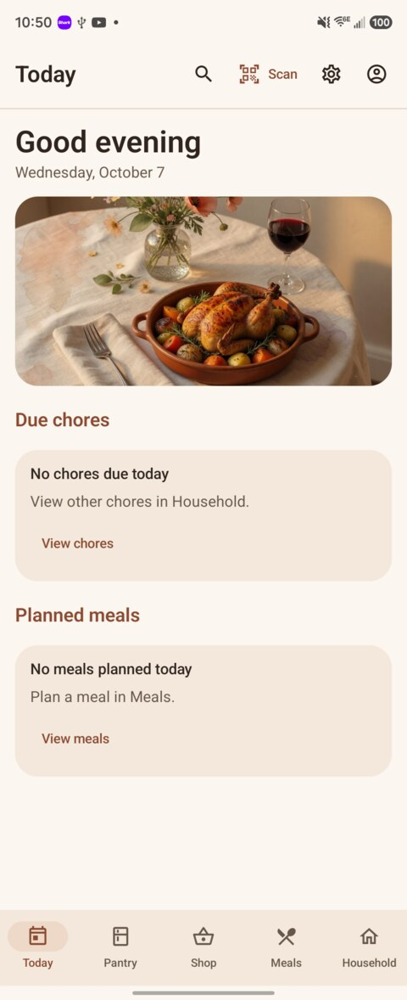
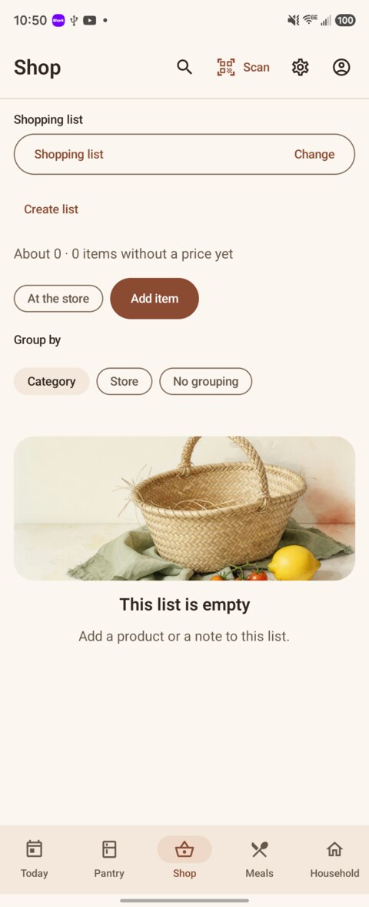
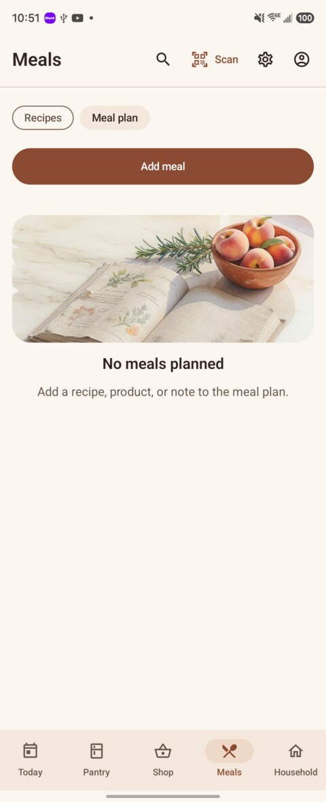
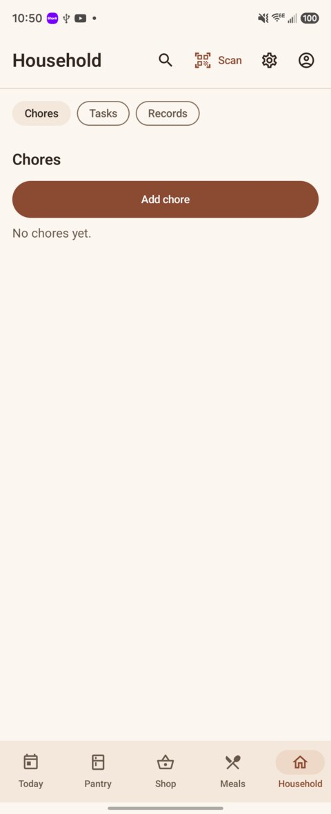

<p align="center">
  
</p>

<h1 align="center">Stillroom</h1>

<p align="center">
  <strong>A kitchen companion for the Grocy pantry you already run.</strong>
</p>

<p align="center">
  Pantry, shopping, meals, chores, and a barcode scanner on your phone.<br>
  <a href="https://grocy.info/">Grocy</a> stays the system of record.
</p>

<p align="center">
  <a href="LICENSE"></a>
  <a href="https://github.com/exquisiteskink/Stillroom/releases/latest"></a>
  <a href="https://github.com/exquisiteskink/Stillroom/actions/workflows/unit-tests.yml"></a>
  
  
  
</p>

<p align="center">
  <a href="#install">Install</a> ·
  <a href="#connect">Connect</a> ·
  <a href="#features">Features</a> ·
  <a href="#privacy">Privacy</a> ·
  <a href="#documentation">Docs</a> ·
  <a href="#support--donations">Donate</a>
</p>

---

## Screenshots

| Today | Shop |
|:---:|:---:|
| <a href="docs/screenshots/today.jpg"></a> | <a href="docs/screenshots/shop.jpg"></a> |
| **Meals** | **Household** |
| <a href="docs/screenshots/meals-plan.jpg"></a> | <a href="docs/screenshots/household.jpg"></a> |

Captured on a Galaxy Z Fold 6 cover display. Live pantry and recipe names stay off GitHub.

> Drop extra portrait frames in `docs/screenshots/` (Pantry, Scan, Settings). Leave household product names and Grocy URLs out of the tree.

---

## What it is

Stillroom is the phone you keep on the counter. [Grocy](https://grocy.info/) stays the ledger.

It is a native Android companion for households that already run Grocy — pantry, shopping, meals, chores, and a barcode scanner — in one terracotta-and-cream kitchen. The official Grocy web app remains authoritative. Every write is meant to show up there after sync.

Sign in with a Grocy **API key** (one key per Grocy user). Child accounts are separate Grocy users with their own keys. Today swaps a breakfast, lunch, or dinner still-life by the hour; recipes are a photo grid.

Package `app.stillroom` · Kotlin · Jetpack Compose · Material 3 · minSdk 26 · MIT.

---

## Features

### Kitchen
- **Today** — due chores and today's meals, with a breakfast / lunch / dinner still-life
- **Pantry** — stock rows (name, amount, due), Use soon and Running low from Grocy, locations and journal
- **Shop** — shopping lists, in-store mode, add/edit items, purchase review
- **Meals** — recipe photo grid, meal plan, cooking mode, consume after review
- **Household** — chores, tasks, batteries, equipment, and master data (Records)

### Capture & stock
- **Scan** — CameraX + on-device ML Kit; torch, zoom, and a clipped viewfinder
- Camera permission is optional; manual barcode entry always works
- Lookup order: Grocy barcodes → enabled Grocy plugin (`add=false`) → Open Food Facts for validated grocery codes
- Purchase and consume from a scan; scanner purchases require the package due date
- Quantities accept fractions; prices stay decimals; barcodes stay strings

### Accounts & sync
- API key stored in the Android Keystore, outside Room, logs, and backups
- One SQLite database per verified account (server + Grocy user id)
- Cache-then-network reads; pull to refresh
- Durable outbox for writes; unknown HTTP outcomes need review instead of silent replay
- Home screen widgets for chores, shopping, and scan
- Optional kitchen reminders with quiet hours

---

## Requirements

| | |
|--|--|
| Android | **8.0+** (`minSdk` 26) |
| Target SDK | 35 |
| Package | `app.stillroom` |
| Server | [Grocy](https://grocy.info/) **4.7.1** (chores, scanner, recipes, meals, batteries, equipment) and **4.6.0** (stock and shopping) |

You need a reachable Grocy URL. Stillroom does not host your pantry.

---

## Install

There is no Play Store listing yet. Sideload the signed APK from GitHub.

### GitHub Releases

1. Download `Stillroom-0.0.1.apk` from [Releases](https://github.com/exquisiteskink/Stillroom/releases/latest).
2. Open the APK on your phone (allow installs from your browser or Files if Android asks).
3. Connect with a Grocy API key as described below.

The APK is signed with Stillroom's first release certificate (`CN=Stillroom`). Later 0.0.x updates will use the same certificate so they can replace this install.

### From source (Omarchy / Linux)

Requires [mise](https://mise.jdx.dev/), curl, unzip, and Linux x86_64:

```sh
mise trust
mise install
mise exec -- ./gradlew --no-daemon assembleDebug
```

mise pins **Java 21** and downloads a project-local Android SDK 35 into ignored `.android-sdk/`. Android Studio is optional.

Debug APK: `app/build/outputs/apk/debug/app-debug.apk`

```sh
adb install -r app/build/outputs/apk/debug/app-debug.apk
```

`assembleRelease` produces an unsigned APK. Distribution builds are signed privately; keep signing keys out of the repository.

Run JVM tests with `mise run unit-test`. Stage gates (`mise run stage:0` … `stage:11`) and disposable Grocy fixtures are documented in [STATUS](docs/STATUS.md).

### Connect

1. In Grocy's web app, open **Manage API keys** and create a key for that user.
2. In Stillroom, open **Accounts**.
3. Enter the server URL and the API key, or **Scan API key** from Grocy's QR (`{baseUrl}/api|{key}`).
4. HTTPS is the default. Local HTTP requires the insecure-HTTP toggle.

Stillroom calls `/system/info` and `/user` before saving. A key can be revoked in Grocy without changing a password.

---

## Privacy

- Talks to **your Grocy**. No analytics, crash reporters, or ads.
- `allowBackup` is off. API keys never go in saved state, navigation arguments, or the outbox payload store.
- Public servers should use HTTPS. HTTP sends the key in the clear and needs an explicit opt-in.
- Barcode frames are analyzed on the device. Images are not stored or uploaded.
- Open Food Facts receives only a validated grocery code, a fixed field list, and an identifying User-Agent — never the Grocy key, household inventory, or photos.
- QR codes from the scanner are looked up as text; links are never opened.

See [scanning](docs/SCANNING.md) and [sync](docs/SYNC.md).

---

## Status

Stillroom is **0.0.1**. Stages 0–11 of the original build plan are complete. A debug APK has been installed and walked on a phone against live Grocy 4.7.1.

The formal rows in [PHONE_TEST.md](docs/PHONE_TEST.md) (child login, a real package scan, offline replay, widgets, reminders) remain **not run**. Treat that as the bar for everyday household use.

Grocy permission gaps for child keys are documented in [COMPATIBILITY.md](docs/COMPATIBILITY.md). Stillroom does not add a proxy or fork Grocy to paper over them.

---

## Documentation

| Doc | Topic |
|-----|--------|
| [docs/STATUS.md](docs/STATUS.md) | What actually ran, and what did not |
| [docs/STOCK.md](docs/STOCK.md) | Pantry, due dates, bookings |
| [docs/SHOPPING.md](docs/SHOPPING.md) | Lists and purchase review |
| [docs/RECIPES.md](docs/RECIPES.md) | Recipes, meal plan, cooking |
| [docs/SCANNING.md](docs/SCANNING.md) | Camera, lookup, Open Food Facts |
| [docs/HOUSEHOLD_TOOLS.md](docs/HOUSEHOLD_TOOLS.md) | Chores, tasks, batteries, widgets |
| [docs/SYNC.md](docs/SYNC.md) | Cache, outbox, review |
| [docs/PHONE_TEST.md](docs/PHONE_TEST.md) | Physical-phone checklist |
| [AGENTS.md](AGENTS.md) | Project boundaries for contributors |

Architecture: UI → ViewModel → use case → repository. No GPL copies of grocy-android. No Home Assistant or Hermes.

---

## Support & donations

Stillroom is free and open source. If you want to support development:

- [Ko-fi — exquisiteskink](https://ko-fi.com/exquisiteskink)
- [Liberapay — exquisiteskink](https://liberapay.com/exquisiteskink/)

These are the only donation channels. Donations are optional; every feature is available without payment.

---

## Contributing

Bug reports, ideas, and pull requests are welcome. See [CONTRIBUTING.md](CONTRIBUTING.md). Keep Grocy as the only backend, keep household API keys and live pantry screenshots out of the repository, and read [AGENTS.md](AGENTS.md) before changing product boundaries.

---

## License

Stillroom is released under the [MIT License](LICENSE).
