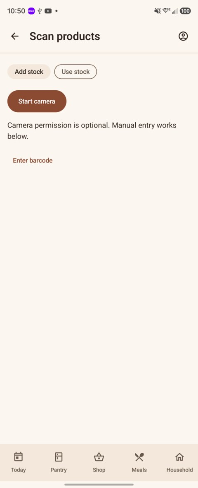

  

<h1 align="center">Stillroom</h1>

  <strong>The kitchen phone for the Grocy pantry you already run.</strong>

  Pantry, shopping, meals, chores, and a barcode scanner on Android. 
  <a href="https://grocy.info/">Grocy</a> stays the system of record.

  
  
  
  

  <a href="#install">Install</a> ·
  <a href="#connect-to-grocy">Connect</a> ·
  <a href="#using-stillroom">Using Stillroom</a> ·
  <a href="#privacy">Privacy</a> ·
  <a href="#support">Support</a>

---

## Screenshots

| Today | Shop | Meals |
|:---:|:---:|:---:|
|  |  |  |
| **Household** | **Scan** | |
|  |  | |

---

## You need Grocy first

Stillroom is a companion for a Grocy server you already host. Your food, lists, recipes, and chores live in Grocy. This app is the phone you keep on the counter.

Before you install:

1. Run [Grocy](https://grocy.info/) somewhere the phone can reach (home server, VPS, or [Grocy Desktop](https://github.com/grocy/grocy-desktop)).
2. Open that Grocy in a browser and sign in. A public try-out is at [demo.grocy.info](https://demo.grocy.info).
3. Confirm the phone is on Android **8.0** or newer.

Stillroom is built for **Grocy 4.7**. Pantry and shopping also work with **4.6**. Chores, recipes, meals, batteries, equipment, and the fuller scanner path need 4.7.

---

## Install

Install the signed APK from GitHub.

1. On your phone, open **[Releases](https://github.com/exquisiteskink/Stillroom/releases/latest)**.
2. Download `Stillroom-0.3.apk` (or the newest `Stillroom-*.apk`).
3. Open the file. If Android blocks it, allow installs from that browser or Files app, then open the APK again.
4. Tap **Install**, then open Stillroom.
5. [Connect to Grocy](#connect-to-grocy) with an API key.

### Updates

Download the newer APK from the same Releases page and install it over the current app. Official releases share one signing certificate, so Android replaces Stillroom and keeps the accounts already on the phone.

If Android says the package conflicts, uninstall Stillroom first, then install the new APK. You will need to add the API key again after that.

---

## Connect to Grocy

Stillroom signs in with a Grocy **API key**, one key per Grocy user. There is no username-and-password login.

1. In Grocy's web app, open the user menu → **Manage API keys**.
2. Create a key for the Grocy user who should appear on this phone. Grocy shows a QR code for that key.
3. In Stillroom, tap the **account** icon in the top bar → **Add account**.
4. Tap **Scan API key** and point the camera at Grocy's QR, or type the server URL (`https://…`) and paste the key.
5. Tap **Connect**.

Each household member uses their own Grocy user and their own key. Add more accounts the same way and switch them under Accounts.

To disconnect a phone, revoke that key in Grocy. Grocy's password stays the same. Logging out in Stillroom removes the saved account from the phone; Grocy's records stay on the server.

### If it will not connect

- Use `https://` for any server on the public internet.
- For a home server with your own certificate, install that CA's **root** in Android: **Settings → Security → Encryption & credentials → Install a certificate → CA certificate**. The address you type must match the name on the certificate, and the server must send its intermediate certificates.
- For a local HTTP test server only, turn on **Allow insecure HTTP**. HTTP sends the API key without encryption.
- A failed certificate check stays failed. Stillroom does not retry the same address as HTTP.

---

## Using Stillroom

Pull down on a screen to refresh from Grocy.

### Today

Due chores, your tasks, and today's meals. Add tasks, filter by category, check them off, or reopen completed tasks. The still-life at the top follows the time of day (breakfast, lunch, or dinner). Kitchen reminder settings live under **Settings**, including quiet hours.

### Pantry

What is in stock: name on the left, amount on the right, due date under the name.

- **Use soon** and **Running low** come from Grocy (due / overdue / expired, and below minimum).
- Tap a product to use stock, add stock, or **Edit product**.
- **Add product** creates the product in Grocy, including Grocy's extra fields.
- **Settings → Stock → Shown details** chooses which extras appear on each row.
- You can send Use soon or Running low items to a shopping list.

### Shop

Shopping lists from Grocy. **At the store** enlarges the list. Checking off a product adds its amount to your pantry. Tap an amount to edit it; press and hold a row to remove it. If another tool books your purchases, select it under **Settings → Grocy add-ons → Shopping purchases** so checkboxes only cross items off.

### Meals

Recipes as a photo grid (picture, name underneath). Open a recipe to cook; amounts scale with servings. Confirming a cook uses stock in Grocy. Today's planned meals open from Today. Save your cooking progress, check off ingredients, and set timers with notifications; resume your session later from Meals.

### Household

Chores, one-off tasks, batteries, equipment, and **Records** (products, locations, units, and the rest of Grocy's household master data).

### Scan

The **Scan** button in the top bar. Choose **Add stock** or **Use stock**, then **Start camera** or type the barcode.

Camera permission is optional; typing always works. The camera looks up Grocy's barcodes first. For a grocery UPC/EAN it can also ask Grocy's plugin, then [Open Food Facts](https://world.openfoodfacts.org/). Confirm add or confirm use before anything is booked. An unknown barcode can be attached to a product you already have; a wrong attachment is removed in Grocy.

**Shopping trip** saves a draft as you scan several products. Review amounts, prices, and dates before confirming purchases. Trip purchases do not also check off shopping-list items; use one purchase route for the same groceries.

### Grocy add-ons

Under **Settings → Grocy add-ons**, control public barcode lookups, choose which tool books shopping purchases, save a web shortcut, or connect BarcodeBuddy with an administrator account. Household also offers Grocy custom records and their image/file attachments.

### Home screen

Optional widgets for your tasks, due chores, shopping counts, and scan. They show cached numbers and open the matching screen.

---

## Privacy

- Talks to **your Grocy**. No analytics, crash reporters, or ads.
- API keys stay in Android's Keystore on this phone. They are left out of backups.
- Barcode frames are read on the device. The scan is not saved or uploaded.
- Open Food Facts receives only a validated grocery code, a short field list, and an identifying User-Agent — never the Grocy key, your inventory, or photos.
- QR codes from the scanner are treated as text. Links are not opened.

---

## Support

Stillroom is free and open source. If you want to support development:

- [Ko-fi — exquisiteskink](https://ko-fi.com/exquisiteskink)
- [Liberapay — exquisiteskink](https://liberapay.com/exquisiteskink/)

These are the only donation channels. Donations are optional; every feature is available without payment.

Something broken? [Open an issue](https://github.com/exquisiteskink/Stillroom/issues).

---

## Contributing

Bug reports, ideas, and pull requests are welcome. Build-from-source and project boundaries are in [CONTRIBUTING.md](CONTRIBUTING.md).

---

## License

Stillroom is released under the [MIT License](LICENSE).
